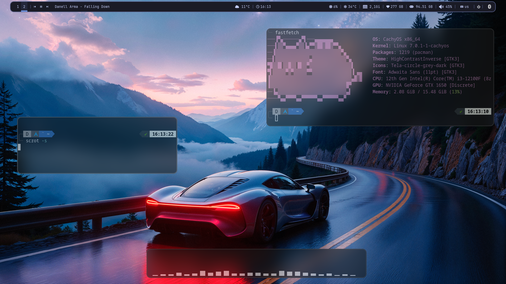
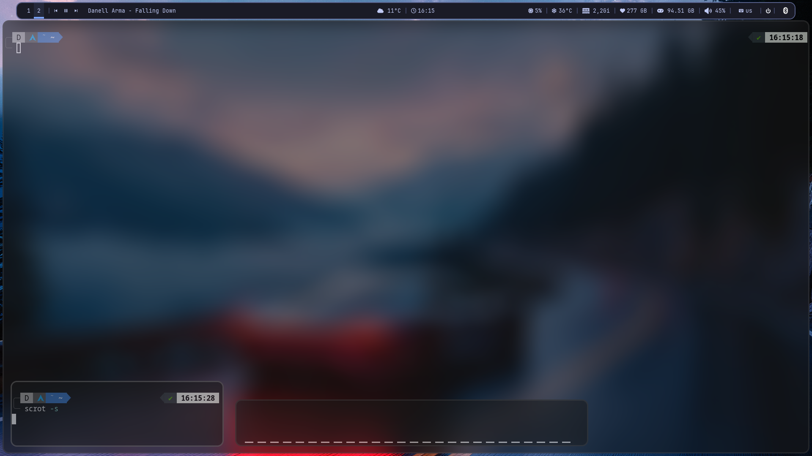

Всем привет это мои ДОТЫ2
Скачиваете дистрибутив и оттуда устанавливаете i3wm(я через CachyOS устанавливаю чистую i3 с ядрами от Cachy)
Клонируете git clone https://github.com/Cixian227/I3WM-MY-DOTS-
Все папки перекидываете в .config
Текстовый файл содержит мои приложения,шрифты и т.п,чтобы polybar и др. программы нормально работали без доработок!
